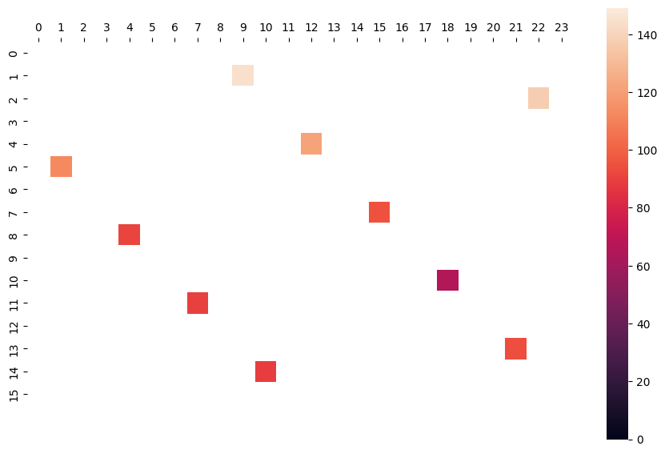
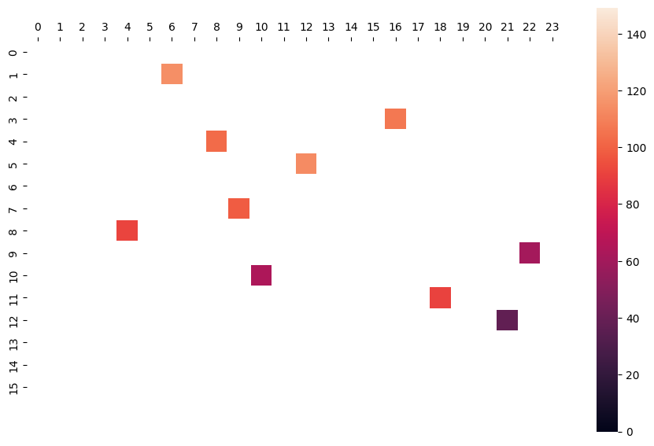
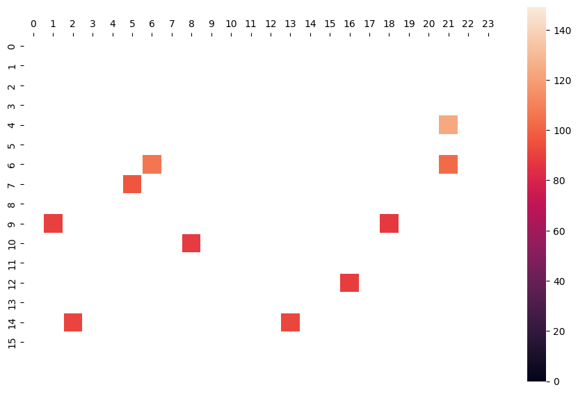
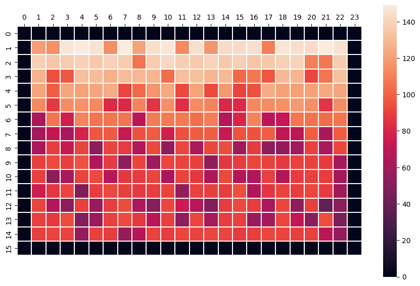

# microplate_layouts_benchmark (WIP)
This is a cleaned version of the benchmarks presented in COMPD and PLAID articles. The goal is to make the replication more straightforward to use and to expand (e.g., when adding new layout types), and to make the benchmark itself more comprehensive, with polished, refactored scripts instead of notebooks. 

e.g., now the script generates proper matching control layouts on the same disturbed plate, that make the comparison between them clear:

  
  
  
  

<em>Three control layouts on the same disturbed plate.</em>

