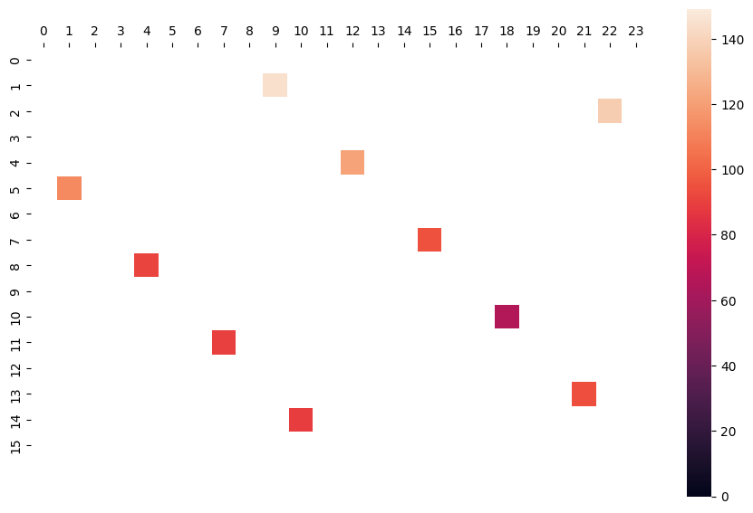
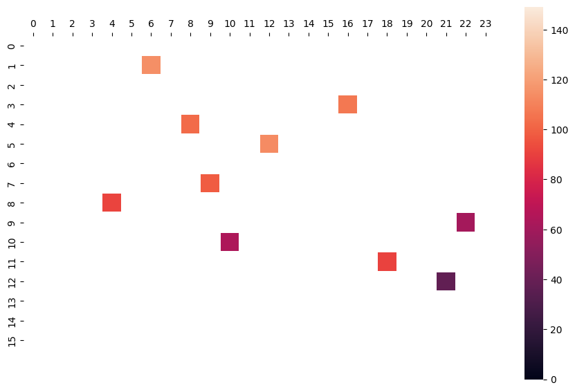
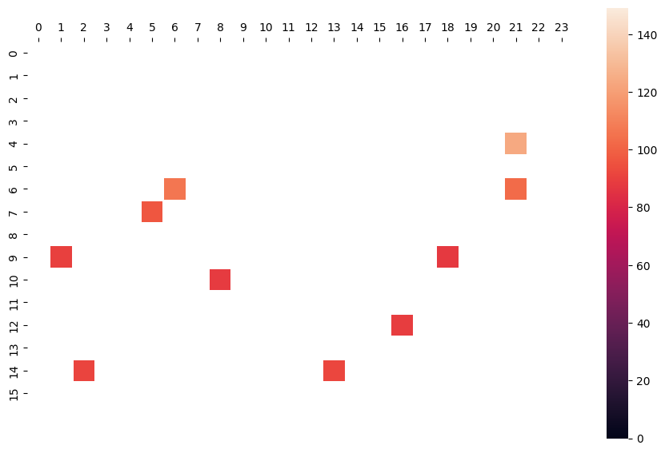
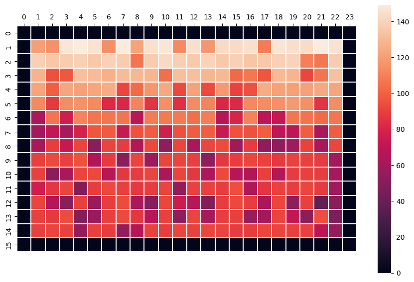

# Benchmark for testing models for microplate layouts
This is a cleaned version of the benchmarks presented in [COMPD]([link](https://github.com/astra-uu-se/COMPD/tree/main/evaluation_aaai26)) and [PLAID](https://github.com/pharmbio/plaid/tree/main/simulations) articles. The goal is to make the replication straightforward to use and to expand (by adding new layout types and new disturbances), and to make the benchmark itself more comprehensive (systematic generation of plots and tables), with polished, refactored scripts instead of notebooks. 

e.g., now the script generates proper matching control layouts on the same disturbed plate (by making sure that the scale is the same across all the layouts), which makes the comparison between them clear:

  
  
  
  

<em>Three control layouts on the same disturbed plate.</em>

# How to use it

To use the benchmark, you need to perform the following steps:

1. Generate the layout files for screening tests, dose-response tests, or both and place them in the folder `layouts\` (you might have to create it). For a quick test, you can unzip the file `layouts.zip` (it contains the generated layout files for border layouts, randomized layouts, PLAID layouts, COMPD 1.00 layouts, and COMPD 1.34 layouts)
2. Edit, if necessary, `benchmark_common.py` to select which layouts you want to compare in screening tests and which layouts you want to compare in dose-response tests. Currently, the file is configured to compare between randomized layouts, PLAID layouts, COMPD 1.00 layouts, and COMPD 1.34 layouts for both sets of tests.
3. Edit, if necessary, `benchmark_disturbances.py` to select which plate disturbances (shapes and strength levels) you want to test the layouts in screening tests and which plate disturbances (shapes and strength levels) you want to test the layouts in dose-response tests
4. Run the Python scripts `run_screening_benchmark.py` and `run_dose_response_benchmark.py`. Each script goes through its own set of stages (perform simulations, then generate the plots, the additional metrics, the LaTeX code for tables, the LaTeX code for the final text). Use the flag `--stage xxx` where `xxx` is the name of the stage to rerun only a specific stage
5. Once the scripts are executed, you can recompile `detailed-experimental-results-source/0_supplement.tex` to generate the pdf with updated plots and tables.
