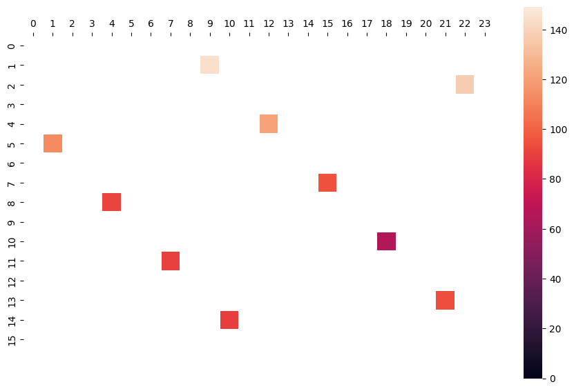
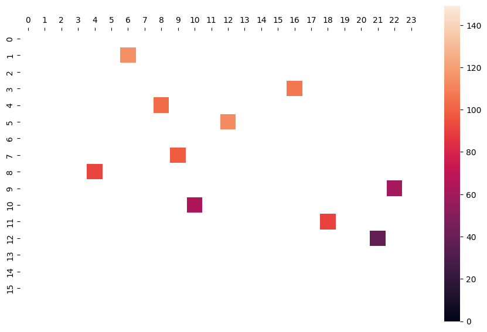
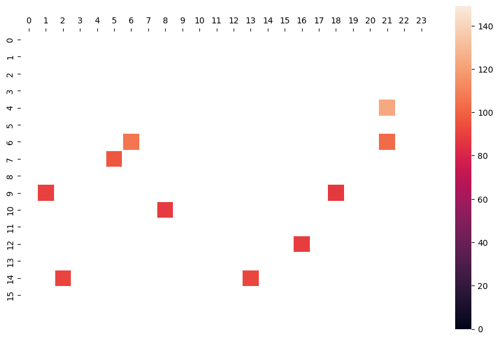
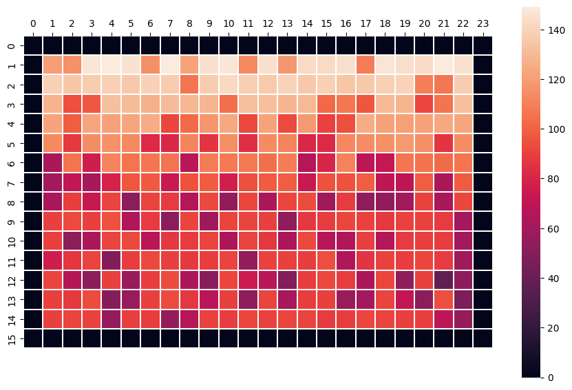

# Benchmark for testing models for microplate layouts
This is a cleaned version of the benchmarks presented in [COMPD](https://github.com/astra-uu-se/COMPD/tree/main/evaluation_aaai26) and [PLAID](https://github.com/pharmbio/plaid/tree/main/simulations) articles. The goal is to make replication straightforward to use and expand (by adding new layout types and disturbances), and to make the benchmark more comprehensive (systematic generation of plots and tables), with polished, refactored scripts instead of notebooks. As an example of what the script produces, you can find the automatically generated [PDF file](detailed-experimental-results-source/0_supplement.pdf) that compares four layout types: randomized layouts, PLAID layouts, COMPD 1.00 layouts, and COMPD 1.34 layouts.

The script also generates proper matching control layouts on the same disturbed plate (by making sure that the scale is the same across all the layouts), which makes the visual comparison between them clear:

<p align="center">
  
  
  
  
</p>
<p align="center"><em>Three control layouts on the same disturbed plate.</em></p>


> [!TIP]
> ## Start here
>
> **I want to reproduce existing figures and tables**
>
> ```bash
> python run_dose_response_benchmark.py --stage figures
> python run_dose_response_benchmark.py --stage tables
>
> python run_screening_benchmark.py --stage figures
> python run_screening_benchmark.py --stage tables
> 
> # Only if the separate quality-metric simulation must be regenerated:
> python run_screening_benchmark.py --stage metrics
> ```
>
> **I want to change a layout**
>
> Read [Editing benchmark layouts](#editing-benchmark-layouts-registry), then run the affected simulation, figure, metrics, and table stages.
>
> **I want to change a disturbance or its labels**
>
> Read [Editing disturbance scenarios](#editing-disturbance-scenarios).
>
> **I want to import a layout from another generator**
>
> Read [Generating and importing layout matrices](#generating-and-importing-layout-matrices), especially the layout encoding and filename contract.


## Contents

- [How to use the benchmark](#how-to-use-the-benchmark)
  - [Generated LaTeX sections](#generated-latex-sections)
- [Generating and importing layout matrices](#generating-and-importing-layout-matrices)
  - [Reference layout-generation material](#reference-layout-generation-material)
  - [PLAID-compatible well encoding and replicate semantics](#plaid-compatible-well-encoding-and-replicate-semantics)
  - [Experimental conditions versus physical observations](#experimental-conditions-versus-physical-observations)
    - [Condition-level encoding](#condition-level-encoding)
    - [Per-well encoding](#per-well-encoding)
  - [Why unique per-well IDs matter](#why-unique-per-well-ids-matter)
  - [COMPD 1.00 compatibility conversion](#compd-100-compatibility-conversion)
  - [Ordering is part of the contract](#ordering-is-part-of-the-contract)
  - [How to choose `requires_layout_update`](#how-to-choose-requires_layout_update)
  - [Negative controls are identified by the maximum code](#negative-controls-are-identified-by-the-maximum-code)
  - [Recommended validation before benchmarking](#recommended-validation-before-benchmarking)
  - [Exporting layouts to `.npy`](#exporting-layouts-to-npy)
  - [Filename and directory contract](#filename-and-directory-contract)
  - [Layout families currently compared](#layout-families-currently-compared)
  - [Effective-layout design principles](#effective-layout-design-principles)
  - [Safe import workflow](#safe-import-workflow)
- [Editing benchmark layouts registry](#editing-benchmark-layouts-registry)
  - [When to edit `benchmark_common.py`](#when-to-edit-benchmark_commonpy)
  - [Safe editing workflow](#safe-editing-workflow)
  - [Important conventions](#important-conventions)
- [Editing disturbance scenarios](#editing-disturbance-scenarios)
  - [When to edit `benchmark_disturbances.py`](#when-to-edit-benchmark_disturbancespy)
  - [Preserve stable identifiers](#preserve-stable-identifiers)
  - [Adding a future disturbance family](#adding-a-future-disturbance-family)
  - [Publication flags and generated LaTeX](#publication-flags-and-generated-latex)
  - [Currently enabled disturbance scenarios](#currently-enabled-disturbance-scenarios)
    - [Dose-response](#dose-response)
    - [Screening](#screening)
	- [Normalization and control treatment](#normalization-and-control-treatment)
  - [Checking the active set](#checking-the-active-set)
- [Running the benchmark pipelines](#running-the-benchmark-pipelines)
  - [Dose-response pipeline](#dose-response-pipeline)
  - [Screening pipeline](#screening-pipeline)
  - [Recommended workflows](#recommended-workflows)
  - [Generated LaTeX is part of `tables`](#generated-latex-is-part-of-tables)
- [Repository data flow](#repository-data-flow)
- [Reproducibility policy](#reproducibility-policy)
  - [Presentation-only changes](#presentation-only-changes)
  - [Scientific/data-generating changes](#scientificdata-generating-changes)

# How to use the benchmark

To use the benchmark, you need to perform the following steps:

1. Install Python and the required packages. To use the reference software environment, use the frozen environment from `requirements_replication.txt` with Python **3.12.10**, e.g. by using the command:
   ```
   cat requirements_replication.txt | xargs -I {} pip install {} 2>/dev/null; echo "Done"
   ```
  
   For a clean install with current compatible versions, use `requirements.txt`.

2. Generate the layout files for screening tests, dose-response tests, or both and place them in the directory `layouts/` (you might have to create it). For a quick test, you can unzip the file `layouts.zip`. The archive `layouts.zip` contains the generated layout files for border layouts, randomized layouts, PLAID layouts, COMPD 1.00 layout files (these layout files were taken directly from the COMPD [repository](https://github.com/astra-uu-se/COMPD/tree/main/evaluation_aaai26) which were used in the evaluation section of the [COMPD paper](https://doi.org/10.1609/aaai.v40i17.38438)), and COMPD 1.34 layouts. It also contains Python scripts to regenerate COMPD 1.34 (or COMPD 1.00 and PLAID layouts, if the scripts and model files are modified). To execute the scripts (files `create_compd_layouts.py` and `create_compd_layouts_dose_response.py`), you will need to install MiniZinc and update the path to the MiniZinc installation in `generate_layouts_utilities.py`
3. Edit, if necessary, `benchmark_common.py` to select which layouts you want to compare in screening tests and which layouts you want to compare in dose-response tests. The default configuration compares four layout families in both pipelines: `Random`, `PLAID`, `COMPD` (legacy COMPD 1.00 layouts), and `COMPD134` (updated COMPD layouts).
4. Edit, if necessary, `benchmark_disturbances.py` to select which plate disturbances (shapes and strength levels) you want to test the layouts in screening tests and which plate disturbances (shapes and strength levels) you want to test the layouts in dose-response tests
5. Run the Python scripts `run_screening_benchmark.py` and `run_dose_response_benchmark.py`. Each script goes through its own set of stages (perform simulations, then generate the plots, the additional metrics, the LaTeX code for tables, the LaTeX code for the final text). Use the flag `--stage xxx` where `xxx` is the name of the stage to rerun only a specific stage (see the comments in each of the files for specifics).
The `tables` stage of both scripts writes both LaTeX table fragments under `tables/` and the generated supplementary section fragment under `tikz-figures/`, thus no manual LaTeX rewiring is required for the automatically generated benchmark LaTeX file.
6. Once the scripts are executed, you can recompile `detailed-experimental-results-source/0_supplement.tex` to generate the pdf with updated plots and tables.


## Generated LaTeX sections

The table stages of benchmark scripts also regenerate two LaTeX section fragments:

- `detailed-experimental-results-source/tikz-figures/dr_section_auto.tex`
- `detailed-experimental-results-source/tikz-figures/screening_section_auto.tex`

These files assemble the benchmark PNGs and LaTeX tables into the supplementary-material structure. They are generated from the same registry and filename conventions used by the benchmark scripts.

In normal use, users should **not edit these generated `.tex` files or manually add individual benchmark figure/table wrappers to LaTeX**. Instead, regenerate the relevant pipeline stage:

```bash
python run_dose_response_benchmark.py --stage tables
python run_screening_benchmark.py --stage tables
```

The supplementary source imports the generated sections using:

```tex
\input{tikz-figures/dr_section_auto}
\input{tikz-figures/screening_section_auto}
```

Manual/semantic TikZ figures remain separate files in `detailed-experimental-results-source/tikz-figures/`. Those figures are intentionally not overwritten by the benchmark scripts.


## Generating and importing layout matrices

The benchmark is **layout-generator agnostic**. It can evaluate layouts generated by COMPD, PLAID, another optimisation model, a graphical tool, or a custom script.

What matters is not the source of a layout, but whether it satisfies the benchmark’s input contract:

1. The layout is stored as a NumPy `.npy` file.
2. Its well encoding follows the PLAID-compatible integer format described below.
3. Its filename and directory match the registered lookup metadata in `benchmark_common.py`.
4. Its dimensions, number of controls, compound/dose/replicate capacity, and normalisation assumptions are compatible with the relevant benchmark configuration.

The benchmark scripts do not invoke a layout solver during normal operation. They load already-generated `.npy` matrices from the registered layout directories.

### Reference layout-generation material

The COMPD repository contains the generation material used for the associated evaluation work:

- [Evaluation layout-generation directory](https://github.com/astra-uu-se/COMPD/tree/main/evaluation_aaai26)
- [MiniZinc `.dzn` input files](https://github.com/astra-uu-se/COMPD/tree/main/evaluation_aaai26/dzn-files)

The `.dzn` files are useful templates for specifying an experiment before generation: plate dimensions, number of experimental items, controls, concentrations, replicates, edge-well policy, and other layout constraints.

They are references and starting points rather than a requirement. A layout generated elsewhere is fully compatible with this benchmark provided that it is exported in the required `.npy` format and registered correctly.

### PLAID-compatible well encoding and replicate semantics

The values in a layout matrix are not arbitrary labels. They define the mapping between physical wells and the benchmark’s simulated assay observations.

The benchmark expects an integer matrix in which every well is one of:

- `0`: an unused/empty well;
- a positive experimental-item identifier;
- the negative-control identifier.

The meaning of a positive experimental-item identifier depends crucially on whether the layout represents technical replicates as repeated labels or as separately encoded wells.

### Experimental conditions versus physical observations

Suppose a dose-response experiment has:

```text
C compounds
D concentrations per compound
R technical replicates per concentration
```

There are then two different counts:

```text
Experimental conditions:       C × D
Physical experimental wells:   C × D × R
```

For example, an experiment with 24 compounds, 6 concentrations, and 2 replicates has:

```text
24 × 6     = 144 compound-concentration conditions
24 × 6 × 2 = 288 physical experimental-well observations
```

With 20 negative controls, the 288 experimental wells fill the 308-well active interior of the standard benchmark plate. A layout generator may encode the two replicate wells in either of two ways.


<details>
<summary><strong>Technical detail: condition-level versus per-well replicate IDs</strong></summary>

#### Condition-level encoding

In a condition-level representation, all replicate wells for the same compound-concentration condition share one integer identifier.

For example, condition 17 may appear twice:

```text
... 17 ... 17 ...
```

This representation has identifiers:

```text
1, 2, ..., C × D
```

and a negative-control identifier of:

```text
C × D + 1
```

For the 24-compound, 6-dose, 2-replicate example:

```text
Experimental IDs:       1 ... 144
Negative-control ID:    145
```

This is a natural representation for a layout generator because it says that both wells belong to the same compound-concentration condition.

However, it is **not directly compatible** with the main dose-response benchmark reader when the benchmark needs each replicate measurement as a separate observation.

#### Per-well encoding

In a per-well representation, every physical experimental well receives its own unique identifier.

For the same example:

```text
Experimental IDs:       1 ... 288
Negative-control ID:    289
```

The two replicate wells for condition 17 no longer share the value `17`. Instead, they receive distinct IDs, for example:

```text
condition 17, replicate 1  -> 17
condition 17, replicate 2  -> 161
```

The exact numeric assignment matters because the benchmark maps these identifiers back to the simulated `plate_content` observations.
</details>

### Why unique per-well IDs matter

The dose-response benchmark uses the layout matrix to collect plate values into a one-dimensional result vector. Its collection logic effectively uses the layout value as the destination index for a well’s measurement.

If two wells use the same positive identifier, the later encountered well replaces the earlier value:

```python
results[neg_control - cell - 1] = plate[row_index][col_index]
```

Therefore, if replicated experimental wells retain the same condition-level ID, one replicate can overwrite another during result collection.

This is not a minor averaging difference. It can cause the benchmark to:

- retain only one observation for a replicated condition;
- lose replicate information before curve fitting;
- produce a result vector shorter than the expected plate-content vector;
- associate measurements with the wrong compound/concentration/replicate observation; or
- fail the explicit layout/result-length compatibility checks.

For this reason, the main dose-response path requires an effectively unique positive identifier for every physical experimental well.

### COMPD 1.00 compatibility conversion

The legacy COMPD 1.00 dose-response layouts use condition-level encoding: technical replicates of the same compound-concentration condition share an ID. These layouts require conversion to per-well identifiers before simulation and result collection.

To support these layouts, the benchmark uses the `requires_layout_update=True` metadata flag in the relevant dose-response layout specification.

When this flag is enabled, the benchmark applies `update_compd_layout(...)` before simulating and reading the plate. The conversion performs the following transformation:

1. Preserve the physical position of every well.
2. Preserve `0` as the empty-well code.
3. Preserve the identity of negative-control wells, while updating their code to the new maximum identifier.
4. For each original condition-level identifier, find all corresponding physical wells.
5. Assign a distinct identifier to each physical well in that condition’s replicate group.

In symbolic form, if the original layout has:

```text
C × D experimental IDs
```

and each condition has `R` replicate wells, the conversion changes:

```text
old experimental IDs:       1 ... C × D
old negative-control ID:    C × D + 1
```

into:

```text
new experimental IDs:       1 ... C × D × R
new negative-control ID:    C × D × R + 1
```

For an original condition identifier `i`, numbered from zero, and its replicate occurrence `j`, numbered from zero, the converted identifier is:

```text
new_id = 1 + i + j × C × D
```

This preserves the condition grouping while making every physical observation addressable by the benchmark.

Enable `requires_layout_update=True` only for the supported conversion contract: condition IDs `1 ... C × D`, exactly `R` occurrences of each condition ID, and negative-control ID `C × D + 1`. Other encodings require their own verified conversion.

The current layout generation script for COMPD 1.34 takes into account the actual format of the layouts and thus sets `requires_layout_update=False`.


### Ordering is part of the contract

The conversion assigns replicate-specific IDs by iterating through the matching wells in stable matrix traversal order: row by row, then column by column.

This means that the layout matrix, its encoded values, and the ordering of generated plate content must agree.

A generator that uses a different ordering convention - for example, column-major order, replicate-major ordering that does not match matrix traversal, or a custom compound/dose ordering - may produce a matrix that is formally valid but scientifically misaligned with the simulated data.

Before importing a new layout family, verify all of the following:

- Which compound/concentration condition corresponds to each original positive identifier?
- Whether repeated IDs represent technical replicates.
- The physical traversal order used to enumerate repeated IDs.
- The ordering used by the benchmark to construct `plate_content`.
- The resulting mapping from unique per-well IDs back to compound, dose, and replicate observations.

### How to choose `requires_layout_update`

Use the registry flag as follows:

| Input layout representation | `requires_layout_update` | Reason |
|---|---:|---|
| Every physical experimental well already has a unique positive ID | `False` | The layout is already in benchmark-ready per-well form |
| Technical-replicate wells reuse a condition-level positive ID | `True` | The benchmark must expand repeated condition IDs into unique per-well IDs |
| The encoding is neither compatible condition-level nor benchmark-ready per-well | Do not import yet | The matrix needs an explicit, verified conversion before use |

Do not set `requires_layout_update=True` as a generic workaround. It is specifically a conversion for the known COMPD-style condition-level encoding. Applying it to a layout with an incompatible ID scheme can silently scramble the mapping between layout wells and simulated observations.

### Negative controls are identified by the maximum code

The current dose-response utilities use the largest layout value as the negative-control identifier:

```python
neg_control_id = np.max(layout)
```

Accordingly:

- All negative-control wells must use the same maximum integer code.
- No experimental well may use a value greater than the negative-control code.
- A layout with multiple control types requires a separately verified encoding strategy; it must not assume that all control types can be represented as the current single negative-control maximum value.
- After a `requires_layout_update` conversion, the negative-control code changes from `C × D + 1` to `C × D × R + 1`.

### Recommended validation before benchmarking

For the standard dose-response configuration with `C` compounds, `D` concentrations, `R` replicates, and 20 negative controls, validate the final matrix after any required conversion:

```python
import numpy as np

layout = np.load("my-layout.npy")

assert layout.shape == (16, 24)
assert np.issubdtype(layout.dtype, np.integer)
assert layout.min() >= 0
+assert np.all(layout[[0, -1], :] == 0)
+assert np.all(layout[:, [0, -1]] == 0)

negative_control_id = int(layout.max())
experimental_ids, counts = np.unique(
    layout[(layout > 0) & (layout < negative_control_id)],
    return_counts=True,
)

assert negative_control_id == C * D * R + 1
assert np.array_equal(experimental_ids, np.arange(1, C * D * R + 1))
assert np.all(counts == 1)
assert np.count_nonzero(layout == negative_control_id) == 20
```

+Checking unique values alone does not detect repeated IDs that can overwrite observations. These checks cover the standard DR geometry and per-well encoding, not screening's additional positive-control code. They do not prove that IDs correspond to the intended compound, concentration, and replicate order; verify that mapping separately with a small hand-audited layout.


### Exporting layouts to `.npy`

A generator should export the final numeric matrix using NumPy, for example:

```python
import numpy as np

# plate_matrix must be a two-dimensional integer array:
# shape == (rows, columns)
# dtype should be an integer dtype.
np.save("my-layout.npy", plate_matrix.astype(int))
```

Before using the file in the benchmark, verify:

```python
import numpy as np

layout = np.load("my-layout.npy")

assert layout.ndim == 2
assert np.issubdtype(layout.dtype, np.integer)
assert layout.min() >= 0
```

These checks establish only the basic file-format contract. They do not verify that the layout has the correct experimental capacity, control placement, or ordering for a particular benchmark scenario.

### Filename and directory contract

The file must be placed in a directory and named according to the corresponding layout specification in `benchmark_common.py`.

The registry associates each layout family with metadata such as:

- Its displayed name, for example `COMPD`, `PLAID`, or `Random`.
- The directory containing its `.npy` files.
- The filename pattern used to select applicable matrices.
- Its plot/table order.
- The normalisation or error-correction strategy associated with that layout in the relevant pipeline.

The benchmark does not infer the layout family from the contents of the matrix. It discovers files through the configured directory and filename pattern, then writes the registered `display_type` into downstream CSVs.

Therefore, a custom layout generated by any method can be evaluated as an existing layout family if it follows the appropriate registered filename convention. To introduce it as a separately reported family, add one new registry specification in `benchmark_common.py`.

### Layout families currently compared

The default configuration compares four layout families in both pipelines:

| Registry key | CSV/figure label | Description | DR `requires_layout_update` |
|---|---|---|---:|
| `random` | `Random` | Randomized baseline | `False` |
| `plaid` | `PLAID` | PLAID comparison layouts | `False` |
| `compd` | `COMPD` | Legacy COMPD 1.00 layouts | `True` |
| `compd134` | `COMPD134` | Updated COMPD layouts in per-well form | `False` |

The conversion flag concerns dose-response encoding. All four families explicitly select two-dimensional LOESS normalization in both pipelines.

The file format is generator-agnostic, but reported provenance should remain accurate. Register a new generator under its own name, such as `MyMethod`, unless its layouts genuinely reproduce an existing comparison family.

### Effective-layout design principles

Regardless of the generation method, candidate layouts should be validated against the design properties relevant to the experiment:

- Balance controls across rows, columns, plate halves, and plate regions where possible.
- Keep controls of the same type sufficiently separated.
- Spread technical replicates across rows and columns.
- For dose-response experiments, spread concentrations of a compound across the plate rather than concentrating them in one region.
- Apply the intended edge-well policy consistently.
- Avoid creating large, systematic empty regions when unused wells are present.

PLAID provides a useful reference implementation of these constraint-based design ideas, including edge-well choices, concentration placement, replication constraints, control balancing, and control separation. [PLAID documentation](https://github.com/pharmbio/plaid) should be consulted when reproducing or extending its encoding and generation semantics.

### Safe import workflow

Adding a newly generated layout is a scientific/configuration change. Use the following sequence:

1. Generate the candidate layout with any suitable model or tool.
2. Export it as a two-dimensional integer `.npy` matrix with PLAID-compatible well codes.
3. Check its shape, integer type, value range, control count, and experimental capacity.
4. Place it in the registered directory using a filename that matches the relevant pattern.
5. Add or update one layout entry in `benchmark_common.py` if the layout needs a new reported identity.
6. Run the relevant `simulate` stage.
7. Verify the generated CSV contents and filenames.
8. Run `figures`, `metrics` where applicable, and `tables`.
9. Inspect the generated LaTeX for unexpected `% MISSING:` comments.
10. Review the resulting plots and tables before using the new layout in scientific comparisons.

Do not add a second hard-coded layout list inside simulation, plotting, table-writing, or LaTeX-generation code. Layout identity and file-discovery metadata belong in `benchmark_common.py`.


## Editing benchmark layouts registry

Layout metadata is centralised in `benchmark_common.py`. This module is the source of truth for the layouts compared by the dose-response and screening benchmarks, including their display names, ordering, layout-file selection, and benchmark-specific normalisation configuration.

The registry-driven design prevents the same layout information from being duplicated in simulation, plotting, table-generation, and LaTeX code.

### When to edit `benchmark_common.py`

Edit `benchmark_common.py` when you need to add a new layout, remove an existing layout, or change metadata associated with an existing layout, which can include:

- Its human-readable `display_type` name, such as `COMPD`, `PLAID`, or `Random`.
- Its display/plot order.
- The directory or filename pattern used to find its layout matrices.
- The layout-selected normalisation callable (`error_correction`). The current reported configuration explicitly selects `loess_2d_correction` for every family in both pipelines.
- The set of layout comparisons used for boxplots, statistical tables, or figure ordering.
- Layout geometry or control-placement metadata needed by one benchmark pipeline.

Do **not** use `benchmark_common.py` to define a new disturbance family. Disturbance metadata belongs in `benchmark_disturbances.py`.

### Safe editing workflow

1. Make the smallest possible metadata change in the relevant layout specification.
2. Keep `display_type` stable unless you deliberately intend to change CSV contents, figure labels, and table labels. It is not just a cosmetic label. The scripts use it as an identifier written into generated result files.
3. Preserve existing directory paths, filename regexes, and ordering unless the corresponding artifacts have been verified.
4. Run the registry consistency checks indirectly by starting the relevant benchmark script:

   ```bash
   python run_dose_response_benchmark.py --stage figures
   python run_screening_benchmark.py --stage figures
   ```

5. Inspect the resulting figure/table filenames before replacing committed artifacts.

### Important conventions

- The benchmark scripts write the registry `display_type` into result CSVs. Plotting and table utilities validate these names against the registry rather than inferring layout identity from filenames.
- Dose-response and screening have separate layout registries because their plate encoding and normalisation conventions differ.
- The configured layout order is scientific presentation metadata: it controls row order in plots and tables, as well as the order of pairwise statistical comparisons.
- Plot/table ordering changes can be applied to existing CSVs. Changing `display_type`, however, changes an identifier stored in those CSVs: migrate existing data explicitly or regenerate it before using the new identifier. Do not mix artifacts generated from incompatible registry states.

For a new layout, add its metadata once to the relevant registry and let the existing plate-type helper functions supply it to the pipeline. There is no need to add a second hard-coded layout list inside a benchmark script or plotting function, as everything is handled naturally through the registry.

## Editing disturbance scenarios

Disturbance metadata is centralised in `benchmark_disturbances.py`. A disturbance entry describes a named family of simulated plate effects and provides the metadata used by both benchmark pipelines and the generated supplementary LaTeX.

Each disturbance defines, as applicable:

- A stable machine-readable `key`.
- An emphasised display name (`emph_name`) and longer human-readable description (`long_label`).
- Dose-response identifiers, including `dr_id_text`, error type, output-file naming metadata, and dose-response error levels.
- Screening identifiers, including `screening_type` and screening error levels.
- Pipeline-selection flags: `publish_dr` and `publish_screening`.
- Dose-response control treatment: `dr_neg_controls_affected` (default `True`); only the protected-control bowl scenario sets it to `False`.

In addition, the resolver functions `_disturbance_function_for_screening_type` and `_disturbance_function_for_dr_id` select the specific disturbance function from `libraries/disturbances.py` for each disturbance type. There is a fair number of various disturbance functions already defined in `libraries/disturbances.py` that can be used in the benchmark, and the file can be expanded to include new functions, if necessary.

The helper functions `dr_scenarios()` and `screening_disturbances()` return only the disturbances marked for publication in the relevant pipeline.

### When to edit `benchmark_disturbances.py`

Edit this file when you need to change:

- A disturbance's presentation label or caption description.
- Which existing disturbance appears in the dose-response or screening supplementary section.
- The mapping between an existing disturbance and its pre-existing scenario identifier.
- The labels used for error strengths, such as the labels displayed as generated-figure columns.
- Pipeline-selection metadata for a disturbance that already has compatible generated artifacts.
- Numeric strengths or `dr_neg_controls_affected`; these change simulated data and require rerunning the affected simulations.

### Preserve stable identifiers

The following fields should be treated as stable identifiers rather than ordinary prose:

- `key`
- `dr_id_text`
- `screening_type`
- Filename/stem/suffix metadata associated with dose-response scenarios
- Numeric error-level values where they are part of existing CSV and PNG filenames

Changing one of these may cause the scripts to look for different CSVs, produce different PNG/table filenames, or leave `% MISSING:` comments in the generated LaTeX sections. If you intentionally change an identifier, regenerate and verify every downstream artifact that uses it.

### Adding a future disturbance family

Adding a genuinely new disturbance requires more than adding a registry row:

1. Add the disturbance metadata and publication flags in `benchmark_disturbances.py`.
2. Map the disturbance to its signal-transformation function. Configure normalization separately in the layout registry, and define negative-control treatment explicitly for DR experiments.
3. Confirm that its error levels, file naming, and figure/table grouping are represented by existing generic logic.
4. Run the simulation stage for the new definition only when that scientific change is intended.
5. Regenerate figures, tables, and the corresponding auto-generated LaTeX section.
6. Check the generated `.tex` file for `% MISSING:` lines before compiling the supplement.

Do not add per-disturbance plotting or LaTeX wrappers when generic registry metadata is sufficient. Captions, subsection headings, figure grids, and table inclusion should be derived from the registry and the existing generators.

### Publication flags and generated LaTeX

Despite their names, `publish_dr` and `publish_screening` are not just LaTeX visibility switches. The accessors `dr_scenarios()` and `screening_disturbances()` filter the configured lists used by the default simulations and generated supplementary sections.

The section generators are:

- `generate_dr_section_tex(cfg)`, writing `tikz-figures/dr_section_auto.tex`.
- `generate_screening_section_tex(cfg)`, writing `tikz-figures/screening_section_auto.tex`.

If all required compatible CSVs and figures already exist, regenerate the relevant `tables` stage after changing a flag. Newly enabled scenarios without existing results require simulation and figure generation first. Missing artifacts are recorded as `% MISSING:` comments; these comments do not mean the corresponding results are available.

### Currently enabled disturbance scenarios

The following values are parameters passed to the registered disturbance functions. They do not represent a common percentage signal increase across all disturbance shapes.

#### Dose-response

The default DR pipeline includes five registered scenarios: four spatial disturbance shapes, with two control-treatment variants of the bowl-shaped effect.

| Registry key | Scenario | Negative controls | Mild | Strong |
|---|---|---|---:|---:|
| `bowl_nl_neg_unaffected` | Bowl-shaped, controls protected | Pre-disturbance measured values retained | 0.055 | 0.085 |
| `bowl_nl_neg_affected` | Bowl-shaped, controls affected | Subject to the bowl transformation | 0.055 | 0.085 |
| `half_column_neg_affected` | Right-half column gradient | Subject to the spatial transformation | 0.20 | 0.40 |
| `row_gradient_neg_affected` | Row gradient, largest uplift at the top | Subject to the spatial transformation | 0.0133 | 0.0267 |
| `striped_row_even_neg_affected` | Alternating-row stripe | Subject to the spatial transformation | 0.20 | 0.40 |

`dr_neg_controls_affected=False` preserves the pre-disturbance negative-control signals, including measurement noise. It does not set them to 100 and does not exempt them from subsequent normalization. All other DR scenarios use `True`; a control at a position with multiplier 1 may nevertheless remain numerically unchanged.

#### Screening

The default screening pipeline includes four disturbance families:

| Registry key | Scenario | Mild | Moderate | Strong |
|---|---|---:|---:|---:|
| `bowl_nl_neg_unaffected` | Bowl-shaped; controls are affected in screening | 0.06 | 0.10 | 0.20 |
| `half_column_neg_affected` | Right-half column gradient | 0.20 | — | 0.40 |
| `row_gradient_neg_affected` | Row gradient, largest uplift at the top | 0.0133 | 0.0200 | 0.0267 |
| `striped_row_even_neg_affected` | Alternating-row stripe | 0.20 | — | 0.40 |

The screening bowl key is a legacy identifier. Its `neg_unaffected` suffix does not describe screening behavior: `dr_neg_controls_affected` is consumed only by the DR pipeline. Screening applies each disturbance to the entire filled plate, including controls, before row-loss processing and normalization. Keep the key stable unless filenames and downstream artifacts are migrated together.

#### Normalization and control treatment

All four families explicitly select `loess_2d_correction`, which delegates to `libraries.normalization.normalize_plate_lowess_2d`. The routine fits negative-control log10 signals over row and column coordinates, subtracts the fitted surface, recenters using fitted control values, transforms back to the original scale, and rescales the negative-control mean to 100. Individual normalized control values need not equal 100.

The spatial transformations use zero-based coordinates `r = 0 ... 15` and `j = 0 ... 23`:

- Bowl-shaped: multiplier `(1 + s*abs(r - 7.5)) * (1 + s*abs(j - 11.5))`, except for protected DR controls.
- Right-half gradient: multiplier 1 for `j < 12`, and `1 + s*(j - 12)/11` for `j >= 12`.
- Row gradient: multiplier `1 + s*(15 - r)`.
- Row stripe: multiplier `1 + s` for even zero-based row indices, and 1 otherwise.

For the right-half gradient, `s` is the increase at the outermost right column; for the row gradient, it is the slope per row; for the stripe, it is the increase in affected rows. Because border wells are buffers, the maximum over occupied wells can be smaller than the maximum over the full array.


### Checking the active set

When changing publication flags or registry metadata, regenerate the relevant table stage:

```bash
python run_dose_response_benchmark.py --stage tables
python run_screening_benchmark.py --stage tables
```

Then inspect:

```text
detailed-experimental-results-source/tikz-figures/dr_section_auto.tex
detailed-experimental-results-source/tikz-figures/screening_section_auto.tex
```

There should be one generated `\subsection{...}` per published disturbance family and no unexpected `% MISSING:` comments.


## Running the benchmark pipelines

Run all commands from the repository root. The benchmark is split into two independent pipelines:

- `run_dose_response_benchmark.py` for dose-response simulations and artifacts.
- `run_screening_benchmark.py` for high-throughput screening simulations and artifacts.

Both drivers are stage-based. This makes it possible to regenerate only the outputs affected by a change instead of re-running the full simulation benchmark.

### Dose-response pipeline

```bash
python run_dose_response_benchmark.py --stage simulate
python run_dose_response_benchmark.py --stage figures
python run_dose_response_benchmark.py --stage tables
python run_dose_response_benchmark.py --stage curves
```

The stages have the following responsibilities:

| Stage | Purpose | Main outputs |
|---|---|---|
| `simulate` | Fills simulated plates, applies disturbances and configured control treatment, normalizes using layout-selected 2D LOESS, fits LL.4 curves, and records estimation outputs | CSV files in `generated-data/dose-response/` |
| `figures` | Reads existing CSVs and creates the benchmark figure PNGs | PNG files in `detailed-experimental-results-source/figures/` |
| `tables` | Reads existing CSVs and writes LaTeX table fragments and the generated dose-response supplementary fragment | `.tex` files in `detailed-experimental-results-source/tables/` and `tikz-figures/dr_section_auto.tex` |
| `curves` | Simulates selected example plates and refits curves to generate illustrative figures; not a CSV-only presentation stage | PNG files in `detailed-experimental-results-source/figures/` |
| `all` | Runs the complete dose-response workflow | All of the above |

For a normal documentation/artifact refresh after modifying caption templates, table formatting, registry labels, or LaTeX-generation logic, run only:

```bash
python run_dose_response_benchmark.py --stage tables
```

For a plotting-only change, when the simulation CSVs already exist and remain valid, run:

```bash
python run_dose_response_benchmark.py --stage figures
```

Use `--stage simulate` only when the simulation inputs themselves have changed, for example a layout matrix, a normalisation implementation, or an intentionally changed disturbance definition. Re-running simulation overwrites or regenerates scientific data artifacts and should therefore be treated as a deliberate change.

### Screening pipeline

```bash
python run_screening_benchmark.py --stage simulate
python run_screening_benchmark.py --stage figures
python run_screening_benchmark.py --stage metrics
python run_screening_benchmark.py --stage tables
```

The screening stages are:

| Stage | Purpose | Main outputs |
|---|---|---|
| `simulate` | Runs screening plate simulations, applies the configured disturbance and normalisation, and writes the data needed for hit-identification and ROC/PR analysis | CSV files in `generated-data/screening/` |
| `figures` | Creates ROC/PR and screening panels from existing CSVs and separately regenerates simulated control-layout illustrations | PNG files in `detailed-experimental-results-source/figures/` |
| `metrics` | Runs a separate control-sampling simulation and generates Z' / SSMD error figures; not presentation-only | Metric CSVs and PNGs in the configured quality-assessment data and figure directories |
| `tables` | Writes screening LaTeX table fragments and the generated screening supplementary fragment | `.tex` files in `detailed-experimental-results-source/tables/` and `tikz-figures/screening_section_auto.tex` |
| `all` | Runs the complete screening workflow | All of the above |

For refreshing screening figures and tables from existing data:

```bash
python run_screening_benchmark.py --stage figures
python run_screening_benchmark.py --stage tables
```

The `figures` stage also regenerates illustrative control-layout plates. Run `--stage metrics` only when you intend to regenerate the separate quality-metric simulation or its required CSVs are missing.

The separate quality-metric experiment uses absolute Gaussian draws with `(mean, SD) = (100, 3)` for the negative group and `(5, 4)` for the positive group, at a nominal 50% active fraction. It sweeps each screening disturbance's parameter from 0 to 0.25 in increments of 0.01, without row removal or normalization. Reference Z' and SSMD values use all occupied wells on the same disturbed plate, grouped by known activity. Control-only estimates are compared with those references using squared differences. This experiment is distinct from the main hit-identification simulation.


For a change limited to screening table formatting, captions, registry labels, or generated supplementary-section wiring, run only:

```bash
python run_screening_benchmark.py --stage tables
```

Use `--stage simulate` only when simulation inputs themselves have intentionally changed, for example the layout matrix, normalisation implementation, control configuration, or disturbance definition.

### Recommended workflows

**Regenerate only supplementary LaTeX/table artifacts**

```bash
python run_dose_response_benchmark.py --stage tables
python run_screening_benchmark.py --stage tables
```

**Regenerate figures and tables from unchanged simulation CSVs**

```bash
python run_dose_response_benchmark.py --stage figures
python run_dose_response_benchmark.py --stage tables

python run_screening_benchmark.py --stage figures
python run_screening_benchmark.py --stage tables
```

**Run a complete reproducibility pass**

```bash
python run_dose_response_benchmark.py --stage all
python run_screening_benchmark.py --stage all
```

### Generated LaTeX is part of `tables`

The `tables` stage writes both ordinary LaTeX table fragments and the generated supplementary section files:

- `detailed-experimental-results-source/tikz-figures/dr_section_auto.tex`
- `detailed-experimental-results-source/tikz-figures/screening_section_auto.tex`

These files are generated from benchmark configuration, registry metadata, filename conventions, and the artifacts that exist on disk. Do not edit them manually.

The supplement imports the generated sections with:

```tex
\input{tikz-figures/dr_section_auto}
\input{tikz-figures/screening_section_auto}
```

Consequently, adding a generated figure/table to the supplement normally requires changing the relevant Python configuration or generator logic and re-running `--stage tables`; it should not require editing the supplement’s LaTeX wrappers by hand.

If an expected figure or table does not exist, the generated section contains a `% MISSING: ...` comment rather than failing. Inspect these comments before compiling the supplementary material.


## Repository data flow

```text
Layout matrices + scientific configuration
          |
          +--> main DR / HTS simulate --> main CSVs --> figures / tables
          |
          +--> screening metrics simulation --> metric CSVs --> metric plots / tables
          |
          +--> DR curves / control illustrations --> illustrative PNGs

Existing PNGs + table fragments + registry metadata
          |
          +--> tables stage --> *_section_auto.tex --> supplement LaTeX
```

`metrics` is a separate data-generating branch, not a consumer of the main screening simulation CSVs. Likewise, DR `curves` and the control illustrations generated by screening `figures` perform their own simulations.

Generated sections reference existing PNGs and tables; they do not generate missing scientific results. Manual/semantic TikZ figures remain separate and are maintained by hand.


## Reproducibility policy

The repository distinguishes between two types of changes.

### Presentation-only changes

Examples include:

- Caption wording.
- Caption-only labels that do not change identifiers stored in CSVs or required input filenames.
- LaTeX table formatting.
- Generated-section layout.
- Plot styling that does not alter the underlying calculations.

These changes normally require only the affected `figures` or `tables` stage. The current `metrics` stage reruns a separate simulation and must not be treated as presentation-only.

### Scientific/data-generating changes

Examples include:

- A layout matrix.
- Plate encoding or `requires_layout_update` behaviour.
- A normalisation method.
- A disturbance function or error strength.
- Simulation parameters, such as dose count, replicate count, control configuration, or hit rate.
- A metric calculation.

Regenerate the affected data-producing branch and its downstream artifacts: main DR/HTS input changes start with `simulate`. Changes confined to the separate quality-metric experiment start with `metrics`. Illustrative DR changes start with `curves`. Metric formulas computed only from existing CSVs may require just the corresponding analysis/presentation stage. Main simulation changes do not automatically require rerunning every independent branch.

Do not combine outputs generated under different scientific configurations in the same supplement or manuscript build.
